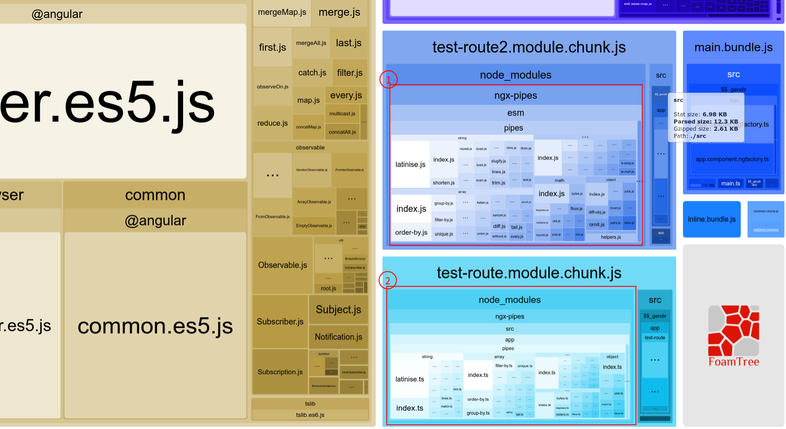

# Demo code for ngx-pipes#70

reproduce steps:

1. npm i / yarn
2. yarn aot
3. yarn bundle-report

you will see the analysis report like:

At a perfect situation, ngx-pipes should be bundled into common chunk(the most right-bottom small blue rectangle).
